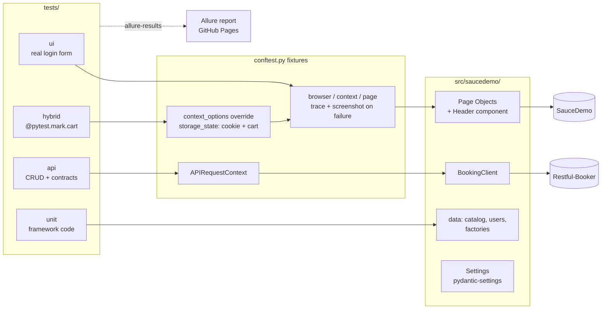
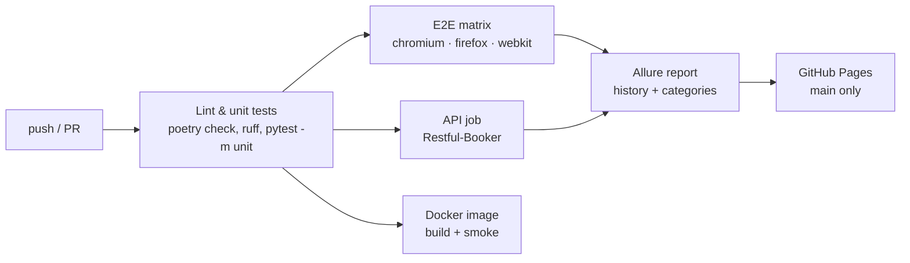
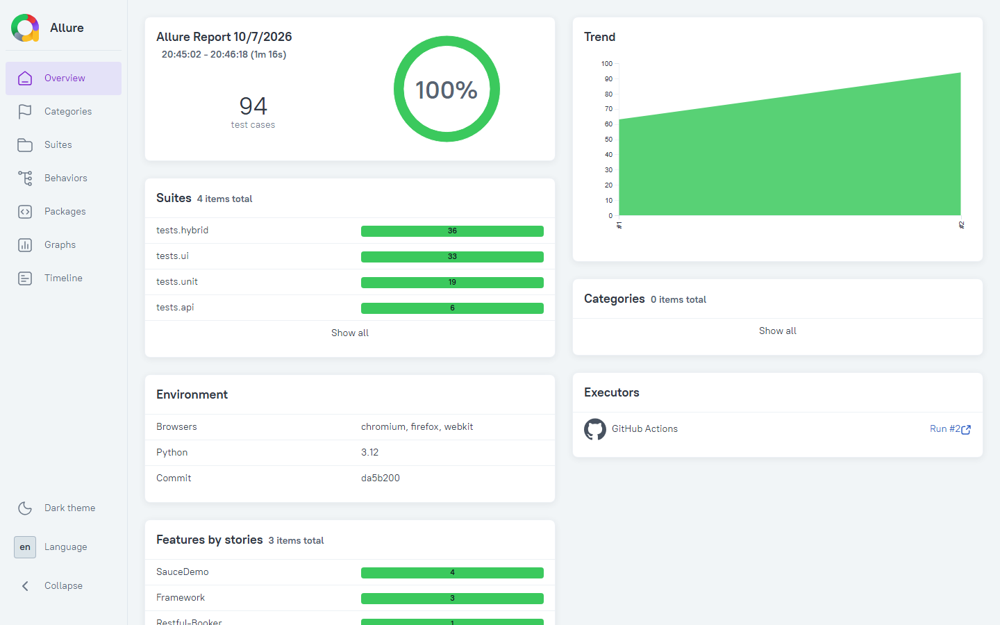
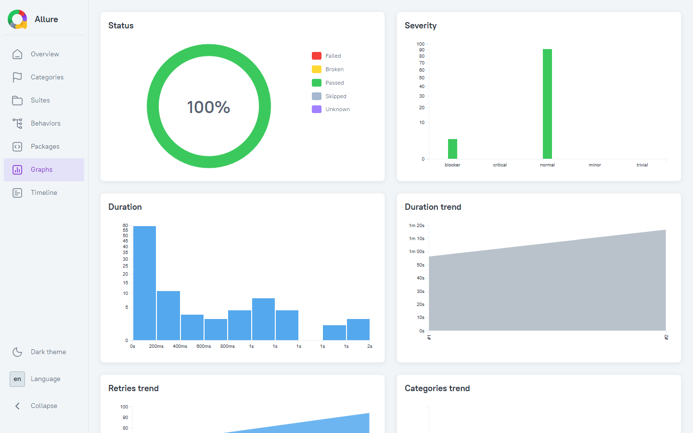
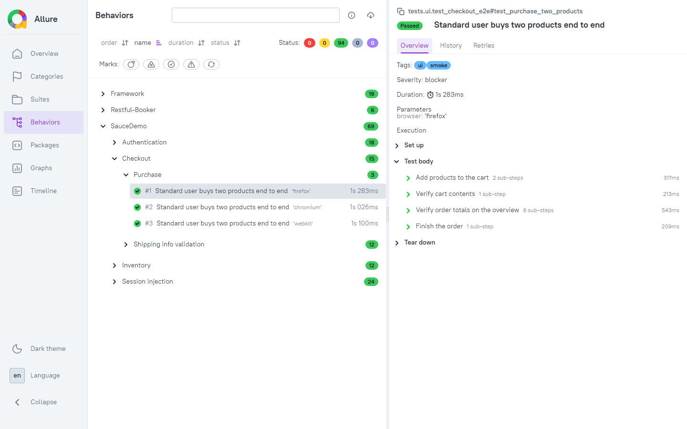
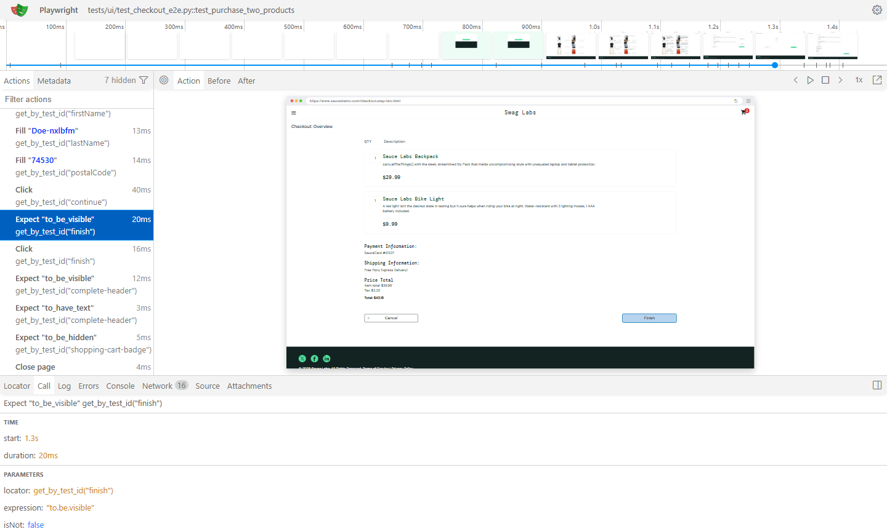

# Playwright Python Hybrid Framework

**English** | [Українська](README.uk.md)

[](https://github.com/KKyrylin005/playwright-python-hybrid-framework/actions/workflows/tests.yml)
[](https://kkyrylin005.github.io/playwright-python-hybrid-framework/)


[](https://github.com/astral-sh/ruff)

End-to-end test automation framework covering **UI, hybrid and API** testing for
[SauceDemo](https://www.saucedemo.com/) (e-commerce) and
[Restful-Booker](https://restful-booker.herokuapp.com/) (REST API).

**Live Allure report:** https://kkyrylin005.github.io/playwright-python-hybrid-framework/

## Highlights

- **Page Object Model with components**: pages own locators and actions, the shared `Header` is composed, not inherited. No assertions in Page Objects.
- **Three test layers**: pure UI journeys, hybrid tests that inject the session and cart through `storage_state`, and API tests on `playwright.request`.
- **Contract checks**: pydantic models with `extra="forbid"` act as JSON schemas for API responses.
- **Cross-browser CI**: Chromium, Firefox and WebKit in a GitHub Actions matrix, run in parallel with `pytest-xdist`.
- **Debuggable failures**: screenshot, URL and Playwright trace attached to Allure automatically.
- **Honest flaky policy**: only Playwright `TimeoutError` is retried, once. Assertion failures never are.
- **Reproducible builds**: `poetry.lock`; the Docker image installs exactly the locked versions and fails fast if `playwright` diverges from the image tag.
- **Tested test code**: unit tests for the framework's own utilities and data layer.

## Architecture



### CI pipeline



## Project structure

```text
├── .github/workflows/tests.yml   CI: lint, unit, E2E matrix, API, Docker, Allure → Pages
├── src/saucedemo/
│   ├── config/settings.py        env-driven settings (E2E_* variables, .env)
│   ├── pages/                    BasePage, Login, Inventory, Cart, Checkout (3 steps)
│   │   └── components/header.py  shared header: cart, logout
│   ├── api/booking_client.py     Restful-Booker client on playwright.request
│   ├── models/                   dataclasses (UI) and pydantic contracts (API)
│   ├── data/                     product catalog, users, unique-data factories
│   └── utils/                    price parsing, storage_state builder
├── tests/
│   ├── conftest.py               Playwright lifecycle, failure artifacts, Allure metadata
│   ├── allure-categories.json    product vs test defects vs infrastructure
│   ├── ui/  hybrid/  api/  unit/
├── Dockerfile                    multi-stage: poetry.lock → pinned requirements
└── docker-compose.yml
```

## Test layers

| Folder | Marker | What it covers |
|---|---|---|
| `tests/ui` | `ui` | Login (positive and negative), sorting, full purchase through the real forms |
| `tests/hybrid` | `hybrid` | Session and cart injected via `storage_state`; checkout validation; catalog vs UI |
| `tests/api` | `api` | Restful-Booker CRUD, auth, 403/404 cases, response schema validation |
| `tests/unit` | `unit` | Price parsing, `storage_state` builder, test data integrity |

A hybrid test starts logged in, with the cart already filled:

```python
@pytest.mark.cart("Sauce Labs Backpack", "Sauce Labs Fleece Jacket")
def test_checkout_with_prefilled_cart(page: Page, customer: Customer) -> None:
    cart = CartPage(page).open()  # no login form, no clicking "Add to cart"
```

## Getting started

Requirements: Python 3.12+, [Poetry](https://python-poetry.org/) 2.x.

```bash
poetry install
poetry run playwright install chromium
poetry run pytest -m smoke
```

Run the full suite in parallel, the same way CI does:

```bash
poetry run pytest -n auto --reruns 1 --only-rerun TimeoutError
```

### Configuration

All settings come from environment variables with the `E2E_` prefix or from a `.env` file
(see [.env.example](.env.example)).

Bash:

```bash
E2E_BROWSER=firefox E2E_HEADLESS=false poetry run pytest -m ui
```

PowerShell:

```powershell
$env:E2E_BROWSER="firefox"; $env:E2E_HEADLESS="false"; poetry run pytest -m ui
```

| Variable | Default | Purpose |
|---|---|---|
| `E2E_BROWSER` | `chromium` | `chromium`, `firefox` or `webkit` |
| `E2E_HEADLESS` | `true` | Show the browser window when `false` |
| `E2E_SLOW_MO` | `0` | Delay between actions, ms |
| `E2E_TRACE_MODE` | `retain-on-failure` | `off`, `on` or `retain-on-failure` |

### Docker

```bash
docker compose run --rm tests
```

Results are written to `artifacts/allure-results` and `artifacts/test-results`.

### Allure report locally

```bash
allure serve allure-results
```

## Reporting

| Overview | Trend graphs |
|---|---|
|  |  |

Test steps, with each browser run kept separate by the `browser` parameter:



Failures are sorted into categories ([tests/allure-categories.json](tests/allure-categories.json)):

| Category | Matches | Meaning |
|---|---|---|
| Infrastructure: action timeout | `TimeoutError` | Slow network or late element; retried once in CI |
| Infrastructure: network or browser failure | `net::ERR_`, connection reset, closed browser | Environment problem |
| Product defect | any failed assertion | The application behaves differently than expected |
| Test defect | any other exception | Bug in test or framework code |

Every failed browser test gets a Playwright trace. Open it from the Allure attachment or locally:

```bash
poetry run playwright show-trace test-results/<test>.zip
```



## Engineering decisions

- **Assertions live in tests only.** Page Objects return data or the next page; `wait_until_loaded()` is synchronisation, not verification.
- **Retry policy.** `TimeoutError` means an action could not complete (slow network, late element), so it is retried once. A failed `expect(...)` is an `AssertionError`: a real bug signal that retries would hide. The trace of the failed attempt is kept as evidence of flakiness.
- **Allure history across the browser matrix.** The `browser` parameter is part of Allure's `historyId`, so results from three browsers stay separate instead of being merged into "retries".
- **Secrets in public reports.** API auth responses are redacted before being attached. Playwright traces do record typed values: acceptable for SauceDemo's public demo credentials, but for a real product authenticate via `storage_state` or keep traces private.
- **Money as `Decimal`.** Order totals are compared exactly, without float rounding errors.
- **Hybrid speed-up, measured honestly.** SauceDemo is a static site and its login is nearly instant, so skipping the UI login saves about a second per test here. The pattern pays off on real applications with slow authentication.
- **External dependency isolation.** Restful-Booker is a shared public sandbox: its tests run in a separate job with retries, so an outage is visible but does not block UI results.
