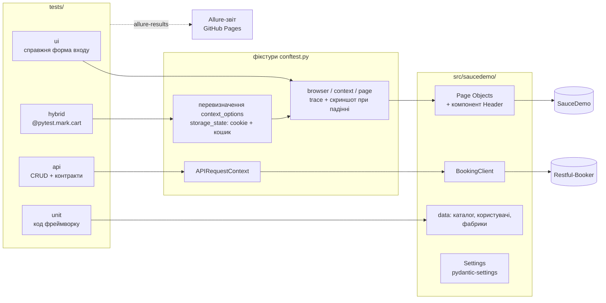
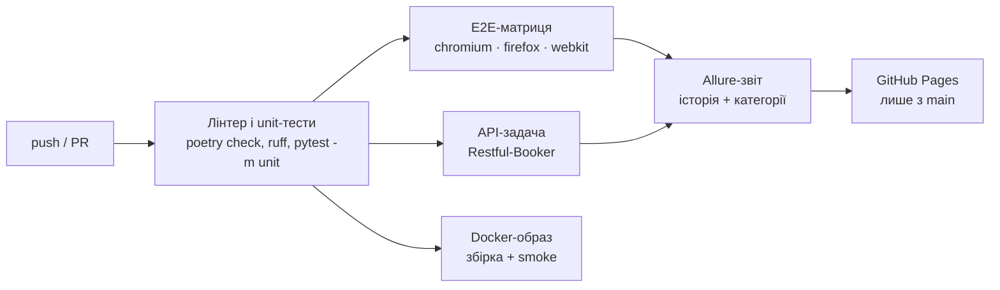

# Playwright Python Hybrid Framework

[English](README.md) | **Українська**

[](https://github.com/KKyrylin005/playwright-python-hybrid-framework/actions/workflows/tests.yml)
[](https://kkyrylin005.github.io/playwright-python-hybrid-framework/)


[](https://github.com/astral-sh/ruff)

Фреймворк для автоматизації end-to-end тестування, що охоплює **UI, гібридні та API** тести
для [SauceDemo](https://www.saucedemo.com/) (інтернет-магазин) і
[Restful-Booker](https://restful-booker.herokuapp.com/) (REST API).

**Allure-звіт онлайн:** https://kkyrylin005.github.io/playwright-python-hybrid-framework/

## Ключові можливості

- **Page Object Model з компонентами**: сторінки містять локатори й дії, спільний `Header` підключається композицією, а не наслідуванням. У Page Object немає перевірок.
- **Три рівні тестів**: чисті UI-сценарії, гібридні тести, що підставляють сесію та кошик через `storage_state`, і API-тести на `playwright.request`.
- **Контрактні перевірки**: pydantic-моделі з `extra="forbid"` працюють як JSON-схеми для відповідей API.
- **Крос-браузерний CI**: Chromium, Firefox і WebKit у матриці GitHub Actions, паралельний запуск через `pytest-xdist`.
- **Зручне дебагування**: скриншот, URL і Playwright trace автоматично додаються до Allure.
- **Чесна політика перезапусків**: перезапускається лише Playwright `TimeoutError` і лише один раз. Провалені перевірки не перезапускаються ніколи.
- **Відтворювані збірки**: `poetry.lock`; Docker-образ встановлює саме зафіксовані версії та одразу падає, якщо версія `playwright` не збігається з тегом образу.
- **Тестований тестовий код**: unit-тести на власні утиліти й шар даних фреймворку.

## Архітектура



### CI-пайплайн



## Структура проєкту

```text
├── .github/workflows/tests.yml   CI: лінтер, unit, E2E-матриця, API, Docker, Allure → Pages
├── src/saucedemo/
│   ├── config/settings.py        налаштування через змінні середовища (E2E_*, .env)
│   ├── pages/                    BasePage, Login, Inventory, Cart, Checkout (3 кроки)
│   │   └── components/header.py  спільна шапка: кошик, вихід
│   ├── api/booking_client.py     клієнт Restful-Booker на playwright.request
│   ├── models/                   dataclasses (UI) і pydantic-контракти (API)
│   ├── data/                     каталог товарів, користувачі, фабрики унікальних даних
│   └── utils/                    парсинг цін, збирання storage_state
├── tests/
│   ├── conftest.py               життєвий цикл Playwright, артефакти падінь, метадані Allure
│   ├── allure-categories.json    дефекти продукту / тестів / інфраструктури
│   ├── ui/  hybrid/  api/  unit/
├── Dockerfile                    multi-stage: poetry.lock → зафіксовані залежності
└── docker-compose.yml
```

## Рівні тестів

| Папка | Маркер | Що покриває |
|---|---|---|
| `tests/ui` | `ui` | Вхід (позитивні й негативні сценарії), сортування, повна покупка через справжні форми |
| `tests/hybrid` | `hybrid` | Сесія та кошик через `storage_state`; валідація оформлення замовлення; каталог проти UI |
| `tests/api` | `api` | CRUD Restful-Booker, авторизація, випадки 403/404, валідація схеми відповідей |
| `tests/unit` | `unit` | Парсинг цін, збирання `storage_state`, цілісність тестових даних |

Гібридний тест стартує вже авторизованим і з заповненим кошиком:

```python
@pytest.mark.cart("Sauce Labs Backpack", "Sauce Labs Fleece Jacket")
def test_checkout_with_prefilled_cart(page: Page, customer: Customer) -> None:
    cart = CartPage(page).open()  # без форми входу і без кліків «Add to cart»
```

## Швидкий старт

Потрібно: Python 3.12+, [Poetry](https://python-poetry.org/) 2.x.

```bash
poetry install
poetry run playwright install chromium
poetry run pytest -m smoke
```

Повний набір паралельно, так само як у CI:

```bash
poetry run pytest -n auto --reruns 1 --only-rerun TimeoutError
```

### Налаштування

Усі параметри задаються змінними середовища з префіксом `E2E_` або у файлі `.env`
(див. [.env.example](.env.example)).

Bash:

```bash
E2E_BROWSER=firefox E2E_HEADLESS=false poetry run pytest -m ui
```

PowerShell:

```powershell
$env:E2E_BROWSER="firefox"; $env:E2E_HEADLESS="false"; poetry run pytest -m ui
```

| Змінна | За замовчуванням | Призначення |
|---|---|---|
| `E2E_BROWSER` | `chromium` | `chromium`, `firefox` або `webkit` |
| `E2E_HEADLESS` | `true` | Показати вікно браузера, якщо `false` |
| `E2E_SLOW_MO` | `0` | Затримка між діями, мс |
| `E2E_TRACE_MODE` | `retain-on-failure` | `off`, `on` або `retain-on-failure` |

### Docker

```bash
docker compose run --rm tests
```

Результати зберігаються в `artifacts/allure-results` і `artifacts/test-results`.

### Allure-звіт локально

```bash
allure serve allure-results
```

## Звітність

| Огляд | Графіки трендів |
|---|---|
|  |  |

Кроки тесту; запуск у кожному браузері відображається окремо завдяки параметру `browser`:


Падіння розподіляються за категоріями ([tests/allure-categories.json](tests/allure-categories.json)):

| Категорія | Що потрапляє | Значення |
|---|---|---|
| Infrastructure: action timeout | `TimeoutError` | Повільна мережа або елемент з'явився пізно; у CI перезапускається один раз |
| Infrastructure: network or browser failure | `net::ERR_`, розрив з'єднання, закритий браузер | Проблема середовища |
| Product defect | будь-яка провалена перевірка | Застосунок поводиться не так, як очікується |
| Test defect | будь-який інший виняток | Помилка в коді тесту чи фреймворку |

Кожен браузерний тест, що впав, отримує Playwright trace. Його можна відкрити з вкладення в Allure або локально:

```bash
poetry run playwright show-trace test-results/<test>.zip
```


## Інженерні рішення

- **Перевірки лише в тестах.** Page Object повертає дані або наступну сторінку; `wait_until_loaded()` — це синхронізація, а не перевірка.
- **Політика перезапусків.** `TimeoutError` означає, що дію не вдалося виконати (повільна мережа, елемент з'явився пізно), тому тест перезапускається один раз. Провалений `expect(...)` — це `AssertionError`, сигнал справжнього бага, який перезапуски лише сховали б. Trace невдалої спроби зберігається як доказ нестабільності.
- **Історія Allure в матриці браузерів.** Параметр `browser` входить до `historyId` в Allure, тож результати трьох браузерів не зливаються в «перезапуски» одного тесту.
- **Секрети в публічних звітах.** Відповіді авторизації API маскуються перед додаванням у звіт. Playwright trace записує введені значення: для публічних демо-даних SauceDemo це прийнятно, але для реального продукту варто авторизуватися через `storage_state` або не публікувати trace.
- **Гроші в `Decimal`.** Суми замовлення порівнюються точно, без похибок округлення `float`.
- **Чесний вимір прискорення.** SauceDemo — статичний сайт із майже миттєвим входом, тож пропуск UI-логіна економить тут близько секунди на тест. Підхід окуповується на реальних застосунках із повільною авторизацією.
- **Ізоляція зовнішньої залежності.** Restful-Booker — спільна публічна пісочниця: її тести працюють в окремій задачі з перезапусками, тож збій видно, але він не блокує результати UI.
